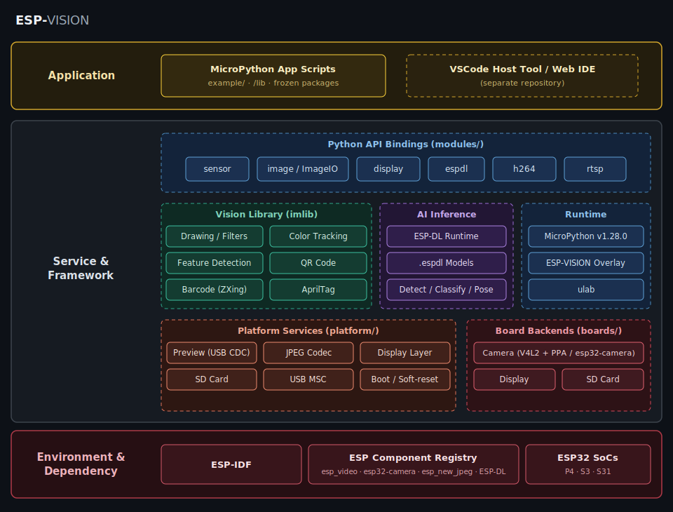

Solution Architecture
=====================

:link_to_translation:`zh_CN:[中文]`

ESP-VISION is organized around a MicroPython firmware build, board-specific hardware backends, shared platform services, and Python-facing vision modules. Code is layered by whether it touches MicroPython (``mp_obj_t`` / ``py/*.h``).

   ESP-VISION layered architecture overview

Layered Overview
----------------

.. blockdiag::

   blockdiag {
     orientation = portrait;
     default_group_color = none;

     scripts  [label = "MicroPython scripts\n(example/)"];
     bindings [label = "Bindings (modules/)\nsensor / image / display / espdl / tflite"];
     platform [label = "Platform services\n(platform/)"];
     imlib    [label = "imlib component\n(components/imlib)"];
     boards   [label = "Board backends\n(boards/<BOARD>)"];
     mp       [label = "MicroPython + overlay\n(build/, overlay/)"];

     scripts  -> bindings;
     bindings -> platform;
     bindings -> imlib;
     platform -> boards;
     boards   -> mp;
   }

- **Bindings** (``modules/``): the ``USER_C_MODULES`` layer. The main modules ``image``, ``sensor``, ``display``, ``espdl``, and ``tflite`` self-register via ``MP_REGISTER_MODULE``. ``py_imageio.c`` provides the ``image.ImageIO`` type, and ``py_helper.c`` is shared helper code. Bindings only do object conversion and light API adaptation; heavy logic lives in pure C or ``platform/``.
- **Platform services** (``platform/``): self-written ESP32 glue. ``preview.c`` (EVFRAME JPEG preview over USB CDC), ``display.c`` (generic display layer), ``sdcard.c`` (mount at ``/sdcard``), ``usb_msc.c`` (exposes the ``ffat`` partition over TinyUSB MSC), ``jpeg.c`` (hardware or software JPEG), ``debug.c``, and ``main.c`` (startup init plus the soft-reset loop).
- **imlib component** (``components/imlib/``): pure-C vision algorithms, an IDF component maintained as MIT, derived from OpenMV ``lib/imlib``.
- **Board backends** (``boards/<BOARD>/``): per-board configuration and the real camera/display/sdcard implementations. P4X and S31 use ``esp_video``/V4L2; P4X also uses PPA, while S3 uses ``esp32-camera``.
- **MicroPython + overlay**: MicroPython v1.28.0 is the fixed baseline; project changes live in ``overlay/micropython/`` and are applied to a generated build copy under ``build/micropython/``.

Capture-to-Output Data Flow
---------------------------

.. blockdiag::

   blockdiag {
     orientation = portrait;

     sensor [label = "Camera sensor"];
     snap   [label = "sensor.snapshot()"];
     img    [label = "image.Image\n(reusable framebuffer)"];
     proc   [label = "imlib processing /\nAI inference"];
     lcd    [label = "display.write()\n-> LCD"];
     prev   [label = "img.flush()\n-> USB CDC preview"];

     sensor -> snap -> img;
     img -> proc;
     img -> lcd;
     img -> prev;
   }

``sensor.snapshot()`` captures a frame into a reusable framebuffer wrapped as an ``image.Image``. Scripts then run ``imlib`` processing, ESP-DL inference, or TFLite Micro inference on the image, and send it to the LCD with ``display.write()`` or to the host preview with ``img.flush()``.

Source Tree
-----------

.. list-table::
   :header-rows: 1
   :widths: 25 75

   * - Path
     - Responsibility
   * - ``idf_ext.py``
     - Board-aware ``idf.py`` extension for the repository root.
   * - ``micropython.cmake``
     - Integration hub: registers user modules, platform and board sources, include paths, conditional ``zxing``, and ``ulab``.
   * - ``lib/``
     - Pinned third-party submodules (MicroPython, ``ulab``, ZXing-C++).
   * - ``overlay/micropython/``
     - ESP-VISION MicroPython delta, using the MicroPython path layout.
   * - ``boards/``
     - Per-board config, frozen manifests, and board peripheral backends.
   * - ``platform/``
     - Shared runtime services (camera, preview, storage, display, USB, JPEG).
   * - ``modules/``
     - MicroPython C/C++ bindings (``sensor``, ``image``, ``display``, ``imageio``, ``espdl``, ``tflite``, plus chip-dependent ``h264`` and ``rtsp``).
   * - ``components/``
     - ESP-IDF components, including OpenMV ``imlib`` and the ZXing backend.
   * - ``models/``
     - Optional model assets loaded from board storage at runtime.
   * - ``example/``
     - MicroPython example scripts.
   * - ``stubs/``
     - ``.pyi`` type stubs describing the C modules.

Board Composition
-----------------

A board is defined in a single tree, ``boards/<BOARD>/``:

- ESP-VISION side (top level): ``boardconfig.h``, ``imlib_config.h``, ``manifest.py``, and optional ``camera.c`` / ``display.c`` / ``sdcard.c``.
- MicroPython port side (``boards/<BOARD>/port/``): ``IDF_TARGET`` value, sdkconfig, partitions, and USB strings. The build projects this subdirectory onto ``ports/esp32/boards/<BOARD>/`` of the generated MicroPython copy.

See :doc:`../how-to/add-board` for the step-by-step procedure.

Chip-Dependent Sources
----------------------

``micropython.cmake`` selects modules from ``IDF_TARGET`` and the board profile. The ESP32-P4 build includes ``h264`` and ``rtsp``; the current P4 board profiles also enable the ZXing-C++ barcode backend. See :doc:`../target-support/index` for the resulting public API matrix.

MicroPython Overlay
-------------------

ESP-VISION uses MicroPython v1.28.0 as a fixed upstream baseline. Project changes to the ESP32 port live under ``overlay/micropython/``. The ``prepare-micropython`` build step applies that tree to a generated copy under ``build/micropython/idf<ESP_IDF_VERSION>/micropython/``; the ``lib/micropython`` submodule remains a clean upstream reference.

For how ESP-VISION relates to its upstream projects, see :doc:`../project-relationship/index`; for the license of each component, see :doc:`../license/index`.
